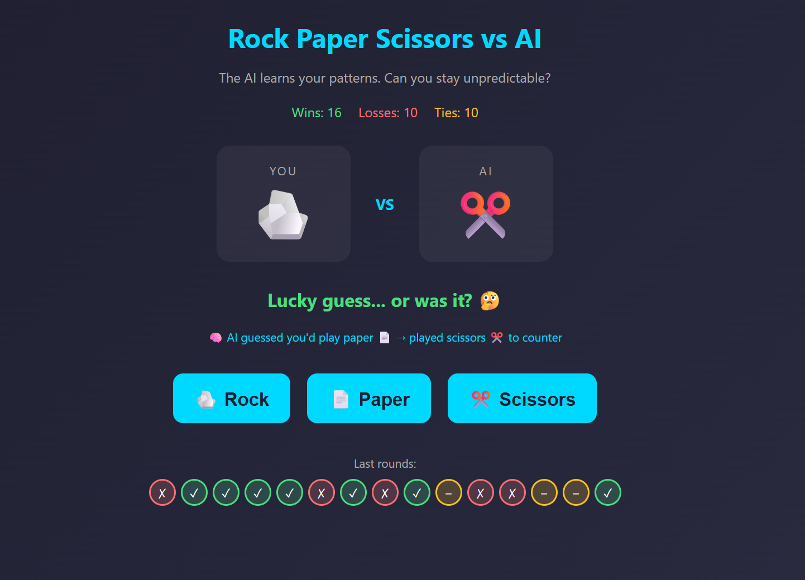

# 🤖 RPS-AI: Can You Beat the Pattern?

A sleek, neon-drenched Rock-Paper-Scissors web game where you play against an AI that actively learns your move patterns. 

Built as a hands-on project to explore foundational Machine Learning concepts, this game uses a predictive algorithm to anticipate human behavior and counter it in real-time.

---

## 🎮 How the Game Works

At its core, this is a standard game of Rock-Paper-Scissors (Rock beats Scissors, Scissors beats Paper, Paper beats Rock). However, instead of playing against a randomized opponent, the AI is actively studying you.

**The Game Loop:**
1. **You make a move:** You click Rock, Paper, or Scissors.
2. **The AI predicts:** Before your move is finalized, the AI looks at your *previous* move and consults its memory to guess what you are about to do.
3. **The Counter:** The AI automatically plays the move that beats its prediction.
4. **Learning:** The AI updates its internal matrix with what you *actually* played, making it smarter for the next round. 

If you play predictably, the AI will crush you. If you play erratically, the AI will be forced to guess randomly until a new pattern emerges.

---

## 🧠 Concepts Learned: Introduction to ML Systems

Instead of just reading theory, I built this project to practically implement a foundational Machine Learning concept: **Markov Chains**. This game serves as an experiment in state-tracking, probability distribution, and algorithmic decision-making.

### What is a Markov Chain?
A Markov Chain is a mathematical system that experiences transitions from one "state" to another according to probabilistic rules. Its defining characteristic is the **Markov Property** (or being "memoryless")—the assumption that the future depends *only* on the present state, not on the sequence of events that preceded it.

In simple terms: to predict tomorrow's weather, you only look at today's weather, completely ignoring last week.

### Applying Markov Chains to Rock-Paper-Scissors
In this game, I implemented a **1st-Order Markov Chain**.

* **The States:** Rock, Paper, and Scissors.
* **The Present State ($X_n$):** The move you just played.
* **The Future State ($X_{n+1}$):** The move you are about to play.

Under the hood, the AI builds a **Transition Matrix** in real-time. It maintains a `memory` object that tracks the frequency of your follow-up moves. 

**Example Transition Matrix:**
| Current Move | ...followed by Rock | ...followed by Paper | ...followed by Scissors |
| :----------- | :-------------------| :--------------------| :-----------------------|
| **Rock**     | 1                   | **4**                | 0                       |
| **Paper**    | 2                   | 0                    | 1                       |
| **Scissors** | 0                   | 2                    | 0                       |

If your last move was **Rock**, the AI checks the "Rock" row. It sees that out of 5 times you played Rock, you followed it up with Paper 4 times. By calculating that $P(\text{Paper} \mid \text{Rock})$ is the highest probability, the AI confidently predicts you will play Paper, and it plays Scissors to win.

---

## 🛠️ Tech Stack

* **HTML5:** Semantic structure and layout.
* **CSS3:** Custom keyframe animations (`floaty`), flexbox layouts, gradient text masking, and responsive design.
* **Vanilla JavaScript:** DOM manipulation, dynamic particle generation (fireworks), state management, and the core Markov predictive algorithm.

---

## 🚀 How to Play

click - https://monishazz.github.io/rps-ai-game/
